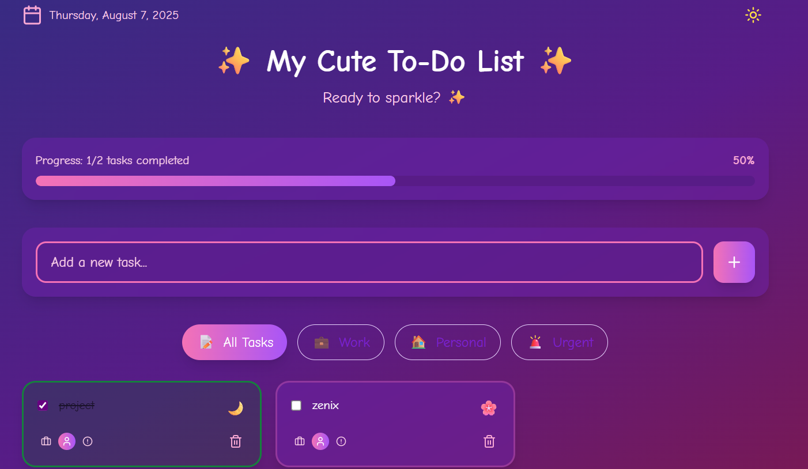

# Aesthetic To-Do List Web App

A cute, minimal, and responsive To-Do List app built using **Tailwind CSS**, **Vanilla JavaScript**, and a sprinkle of confetti magic.  
Manage your tasks with motivation, categories, emojis, and dark mode support! 

---

## Features

- Add, complete, and delete individual tasks
- Filter by category: Work, Personal, Urgent
- Confetti when all tasks are completed
- Dark mode toggle
- Emoji per task and aesthetic UI
- Persistent data using `localStorage`
- Motivational messages
- Progress bar that updates in real-time

---

## Screenshots

### Light Mode


### Dark Mode


---

## Getting Started

### 1. Clone the Repository

```bash
git clone https://github.com/zenix20/Aesthetic-To-do-List.git
cd Aesthetic-To-do-List
```

### 2. Open index.html

Open the project in your browser by simply double-clicking on index.html or serving it using a local server (like Live Server in VSCode).

## Built With 

- Tailwind CSS (via CDN)
- Vanilla JavaScript
- HTML5
- CSS3

## Credits

- Canvas Confetti for the confetti animation.
- Lucide Icons for SVG icons.
